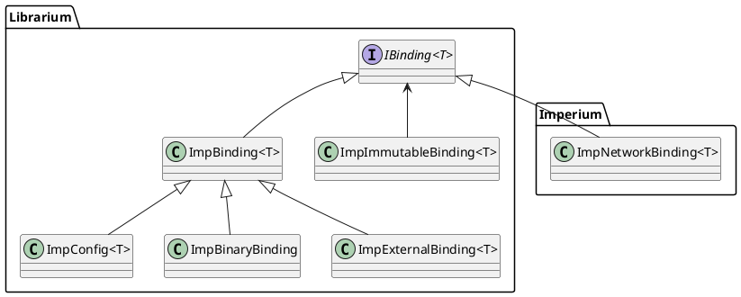

# Imperium API

The Imperium API provides debugging tools and visualizers for mod developers to speed up their debugging and testing workflows. The API consists of the following modules.

- **[Visualization API](visualization/static.md)**  
  Tools to visualize position, hitboxes and custom information for various game objects.
- **[Portal API](portal.md)**  
  An interface to add your own custom UI elements to the Imperium's Interaction window.
- **[Event Logging API](event-log.md)**  
  Tools to log events in-game to Imperium's event log with additional event information.
- **[World API (WIP)](world.md)**  
  Tools to spawn and otherwise interact with game objects such as enemies or valuables.

To complement your debugging experience with Imperium, it is recommended to use the tools available in [Librarium](https://github.com/giosuel/librarium), a library that contains core utility that Imperium is using. For more information, please refer to librarium's code documentation.

## Quick Start

In the following sections I will briefly go over how Imperium works and some tips for working with the Imperium API.

### The Imperium Binding

Imperium is built on top of an event system called _bindings_. Bindings are value containers that can be subscribed to. Subscribers of a binding will be notified whenever the binding's value has been updated.

!!! tip
    For example, Imperium uses bindings internally to separate mod logic from the UI frontend. You can think of bindings as the model in the popular MVP architecture that is widely used for UIs.

All bindings implement the `IBinding<T>` interface that defines the basic functionality of the binding. If you want, you can implement your own binding logic, but it is recommended to use the three ready-to-use binding implementations that Librarium already provides.

| 
Binding Implementation
 | Source    | Description                                                                                                                                                                                               |
| ----------------------------------------------------- | --------- | --------------------------------------------------------------------------------------------------------------------------------------------------------------------------------------------------------- |
| `ImpBinding<T>`                                       | Librarium | The most basic implementation of a multi-purpose binding. Is used extensively throughout Imperium's codebase.                                                                                             |
| `ImpBinaryBinding`                                    | Librarium | A more specific implementation of the `ImpBinding` where `T` is a boolean value. |
| `ImpExternalBinding<T>`                                    | Librarium | A more specific implementation of the `ImpBinding` that gets its value via a provided function and updates whenever a provided master binding updates. |
| `ImpConfigBinding<T>`                                 | Librarium | A binding that internally syncs with a BepInEx config.                                                                                                                                                    |
| `ImpImmutableBinding<T>`                              | Librarium | A binding that is read-only. Mainly used to expose an existing binding for the Imperium API without enabling API users to change its value.                                                               |
| `ImpNetworkBinding<T>`                                | Imperium  | A binding that is synchronized across the network for all clients in the lobby. This binding only works in the context of Imperium and requires an instance of `Imperium.ImpNetworking` to work properly. |

For more information on how to use the bindings, please refer to the code documentations of [Librarium](https://github.com/giosuel/librarium/tree/main/Librarium/src/Binding) and [Imperium](https://github.com/giosuel/imperium-repo/tree/main/Imperium/src).

### API Availability

API modules are only available as soon as Imperium has been **initialized** and **launched**. When Imperium has not yet been launched, all calls to those modules will result in an `ImperiumAPIException`.

Imperium is **launched** as soon as the main menu is loaded for the first time and remains active until the game is closed. When entering a lobby where the local client is not the host, Imperium requests access from the host of the lobby. If the host does not have Imperium installed or does not allow Imperium access, Imperium will disable itself until leaving that lobby or the host enables Imperium access.

!!! tip
    The binding `Imperium.API.State.IsImperiumEnabled` indicates whether Imperium has been enabled, and by extension is ready to serve API calls.

